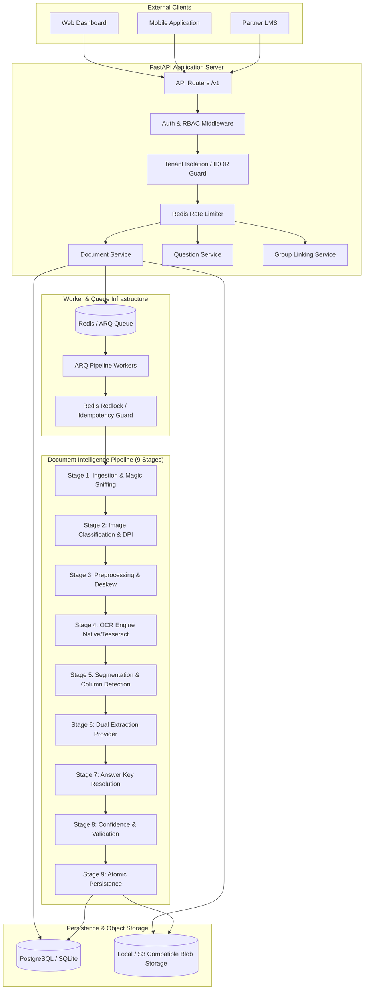
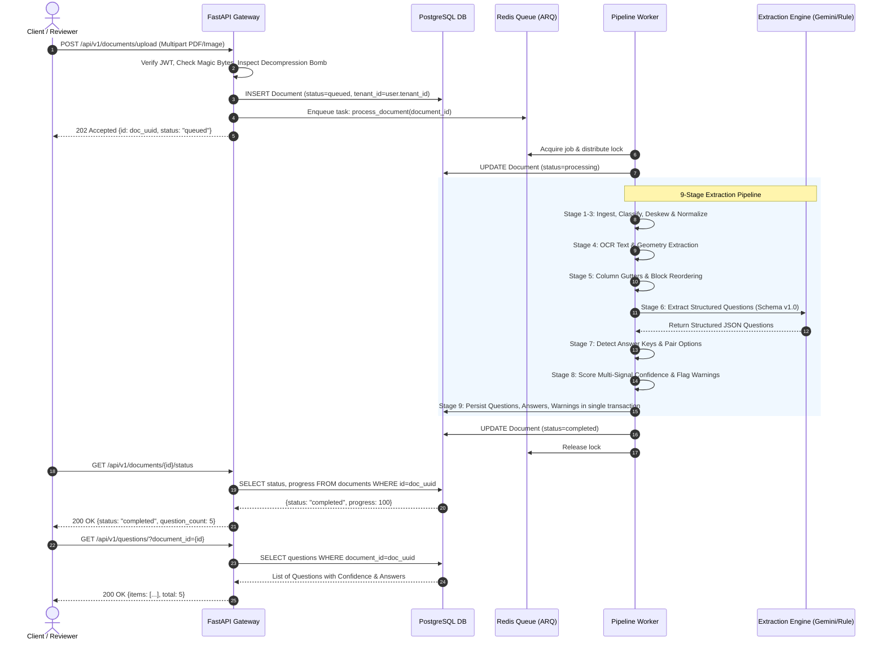
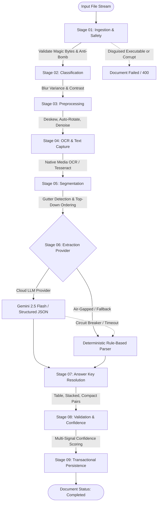
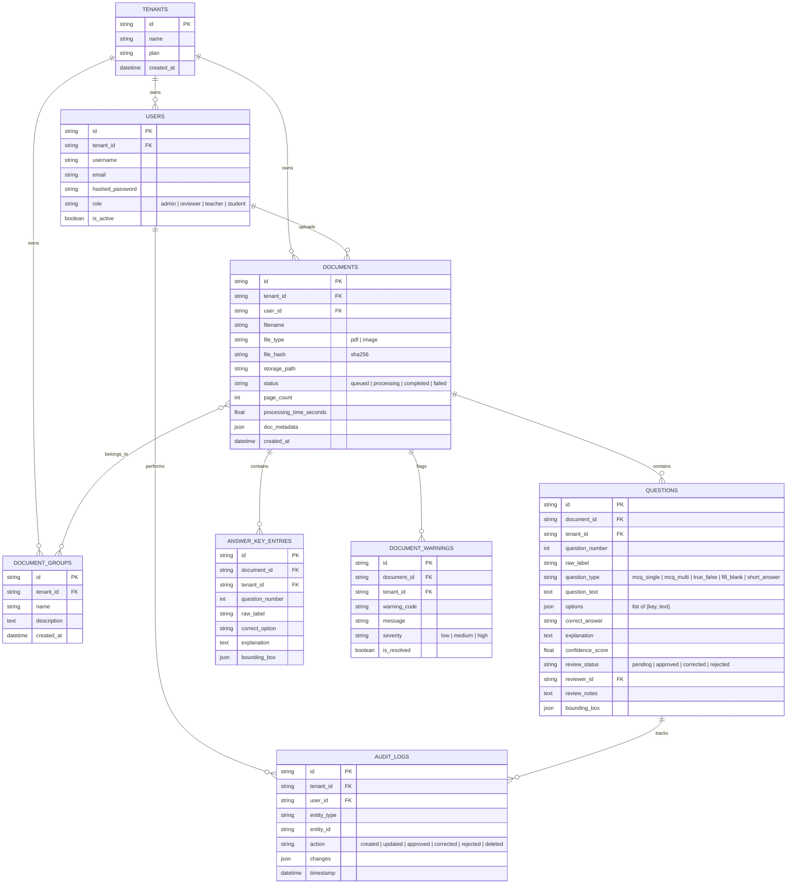
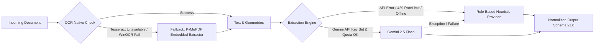

# Pragati Bharti Document Intelligence & Question Extraction Architecture

## 1. Executive Summary

Pragati Bharti is an asynchronous, resilient, multi-tenant document intelligence platform specifically engineered for educational materials (exam papers, question banks, worksheets). The platform ingests diverse formats (PDF, PNG, JPG, JPEG) across arbitrary layouts (single/multi-column, cross-page questions, embedded diagrams/tables, varied numbering schemes, and flexible answer key placements) and converts them into normalized, machine-readable JSON questions exposed via a hardened FastAPI REST API.

```
+---------------------------------------------------------------------------------------+
|                                    CLIENT LAYER                                       |
|               Next.js Web / Mobile Apps / Third-Party LMS Integrations                |
+------------------------------------------+--------------------------------------------+
                                           | HTTPS / REST / JWT
                                           v
+---------------------------------------------------------------------------------------+
|                                  API GATEWAY (FastAPI)                                |
|  - Auth & RBAC (Admin, Reviewer, Teacher)    - Rate Limiter (Sliding Window Redis)    |
|  - Multi-Tenant Isolation & IDOR Defense     - Magic-Byte & Decompression Bomb Guard  |
|  - Prometheus Instrumentation (/metrics)     - Transactional DB Session Management    |
+---------------------+------------------------------------+----------------------------+
                      | Enqueue Job                        | Sync Read/Write
                      v                                    v
          +-----------------------+              +-------------------+
          |  Redis / ARQ Broker   |              | PostgreSQL /      |
          |  Distributed Lock     |              | SQLite (Async)    |
          +-----------+-----------+              +---------+---------+
                      | Worker Job Pull                    |
                      v                                    |
+--------------------------------------------------+       |
|            ASYNC WORKER PIPELINE (9 STAGES)      |       |
|  1. Ingestion & Security Validation              |       |
|  2. Document Classification & DPI Check          |       |
|  3. Preprocessing (Deskew, Denoise, Rotate)      |       |
|  4. OCR & Text Extraction (Native/Tesseract)     |       |
|  5. Semantic Segmentation & Layout Geometry      |       |
|  6. Dual Extraction Engine (Gemini / Heuristic)  |-------+ Atomic Persistence
|  7. Answer Key Matcher & Spatial Locator         |         & Audit Logs
|  8. Quality Validation & Multi-Signal Confidence |
|  9. Transactional Persistence & Event Publish    |
+--------------------------------------------------+
```

---

## 2. System Component Diagram



---

## 3. End-to-End Execution Sequence



---

## 4. The 9-Stage Document Intelligence Pipeline

The extraction pipeline is organized into 9 deterministic, isolated stages. Each stage accepts a shared `PipelineContext` and executes discrete transformations with complete error isolation.



### Detailed Breakdown of Stages:

1. **Stage 01: Ingestion & Safety Validation**:
   - Validates file extensions and inspects real binary magic headers (`%PDF-`, `\x89PNG`, `\xff\xd8\xff`).
   - Blocks disguised executables (`MZ` Windows PE header) immediately with `DISGUISED_EXECUTABLE`.
   - Protects against decompression bombs by checking dimensions against `MAX_IMAGE_PIXELS = 100,000,000`.
   - Generates SHA-256 content hashes for idempotency and duplicate detection.

2. **Stage 02: Document Classification & Quality Inspection**:
   - Determines page count, image resolution, and DPI (defaulting to 300 DPI for PDF rasterization).
   - Computes Laplacian blur variance ($\sigma^2 < 100 \implies$ blurry) and histogram contrast ratio.
   - Attaches non-blocking quality warnings if the input is degraded.

3. **Stage 03: Image Preprocessing**:
   - Applies Otsu adaptive thresholding and morphological gradient calculation.
   - Computes skew angle via minimum bounding box of text contours.
   - Deskews and normalizes orientation when angle deviations exceed $\pm 0.5^\circ$.

4. **Stage 04: OCR & Text Extraction**:
   - Extracts digital text streams with native bounding boxes if PDF contains embedded text.
   - For scanned PDFs or raster images, triggers the pluggable OCR engine (Windows Media Native OCR with automated fallback / Linux Tesseract-OCR container).
   - Produces raw text, character bounding boxes, and line geometry.

5. **Stage 05: Segmentation & Layout Ordering**:
   - Identifies multi-column page layouts by analyzing horizontal projection profiles and vertical gutters.
   - Sorts text blocks in correct reading order (Column 1 top-to-bottom, then Column 2 top-to-bottom) avoiding interleaved cross-column text corruption.
   - Detects question boundaries across line headers (e.g., `Q.1`, `(1)`, `Question 1`, `1.`).

6. **Stage 06: Structured Extraction (Dual Provider Engine)**:
   - **Primary Engine**: Google Gemini 2.5 Flash via structured JSON schema adherence.
   - **Deterministic Fallback**: Local regex and layout-aware parser (`RuleBasedExtractionProvider`).
   - Parses question text, type (`mcq_single`, `mcq_multi`, `true_false`, `fill_blank`, `short_answer`), options, inline tables, and sub-questions.

7. **Stage 07: Answer Key Resolution**:
   - Detects answer key sections regardless of position: document start, document end, or standalone answer key documents.
   - Supports tabular grids (`1 A | 2 B`), compact inline pairs (`1.(a) 2.(c)`), and two-line stacked entries (`Question 1 \n (B) 7`).
   - Pairs answers with extracted questions and records spatial bounding box provenance.

8. **Stage 08: Validation & Confidence Scoring**:
   - Calculates a multi-signal weighted confidence score ($0.0 - 1.0$):
     $$\text{Confidence} = 0.35 \times C_{\text{ocr}} + 0.25 \times C_{\text{num}} + 0.20 \times C_{\text{opts}} + 0.20 \times C_{\text{ans}}$$
   - Flags low-confidence records ($< 0.70$) for human reviewer intervention.

9. **Stage 09: Transactional Persistence**:
   - Commits all questions, options, answer key entries, and warnings in a single atomic database transaction.
   - Logs processing duration, page metrics, and updates document state to `completed`.

---

## 5. Database Entity-Relationship Diagram



---

## 6. Security Architecture & Multi-Tenancy

### 6.1 Multi-Tenant Isolation & IDOR Prevention
Every request is authenticated via signed JWT containing `sub` (User ID), `tenant_id`, and `role`.
- **Repository Scoping**: Every database query executes with `WHERE tenant_id = :tenant_id`.
- **404 Over 403 on Cross-Tenant Access**: To prevent malicious resource enumeration (IDOR), attempting to access, update, or delete a document belonging to another tenant returns `404 Not Found`, giving zero indication whether the foreign ID exists.
- **Admin Isolation**: Super-administrators can view platform-wide operations only through explicit audit oversight endpoints; all standard document endpoints remain tenant-scoped.

### 6.2 Role-Based Access Control (RBAC) Matrix

| Endpoint Group | Role Required | Permissions |
|:---|:---|:---|
| `/auth/token`, `/auth/me` | Any Authenticated | Retrieve token, inspect own identity profile |
| `/documents/upload` | `admin`, `teacher` | Upload exams, trigger extraction pipeline |
| `/documents/{id}` (Read) | `admin`, `reviewer`, `teacher` | View document status, metadata, exports |
| `/documents/{id}` (Delete) | `admin` | Hard/soft delete document & extracted questions |
| `/questions/{id}` (Patch) | `admin`, `reviewer` | Correct OCR errors, update text, options, answers |
| `/questions/{id}/review` | `admin`, `reviewer` | Approve, Correct, or Reject question candidate |
| `/groups/` (Create, Merge) | `admin`, `teacher` | Group question papers with external answer keys |

### 6.3 Input Sanitization & Anti-Exploitation
- **Disguised Executable Defense**: Reads initial 512 bytes for file signatures (`%PDF-`, `\x89PNG`, `\xff\xd8\xff`). Immediately rejects Windows Portable Executable headers (`MZ`) or Mach-O/ELF binaries with `400 DISGUISED_EXECUTABLE`.
- **Decompression Bomb Guard**: Rejects images exceeding `100,000,000` pixels before loading into full memory.
- **Rate Limiting**: Sliding-window rate limiter (default: 60 requests/min per IP/token) with Redis backing.

---

## 7. Resilience, Fallback & Error Handling



- **Dual Extraction Provider**: Gemini 2.5 Flash delivers contextual understanding for handwritten notes, multi-language questions, and diagram captions. If the API key is absent, quota is exceeded, or latency spikes, the system automatically falls back to `RuleBasedExtractionProvider` with zero downtime.
- **Distributed Idempotency Locks**: Redis distributed locks on document hash prevent duplicate parallel extraction tasks.
- **Graceful Degradation on Low-Quality Scans**: If page quality is garbled or illegible, the document completes with explicit quality warnings (`LOW_IMAGE_CONTRAST`, `BLURRY_IMAGE_DETECTED`), setting question review status to `pending` rather than crashing the worker.

---

## 8. Observability & Monitoring

- **Prometheus Metrics (`/metrics`)**:
  - `pragati_http_requests_total{method, endpoint, status}`: Request counter.
  - `pragati_http_request_duration_seconds`: Request latency histogram.
  - `pragati_pipeline_duration_seconds{stage}`: Latency breakdown per pipeline stage.
  - `pragati_extracted_questions_total{type, review_status}`: Extraction volume counter.
- **Structured JSON Logging**: Standardized JSON fields (`request_id`, `tenant_id`, `user_id`, `document_id`, `stage`, `elapsed_ms`) across all log streams.
- **Kubernetes Probes**:
  - `/api/v1/health/live`: Process liveness check.
  - `/api/v1/health/ready`: Validates DB connection and Redis queue responsiveness.
